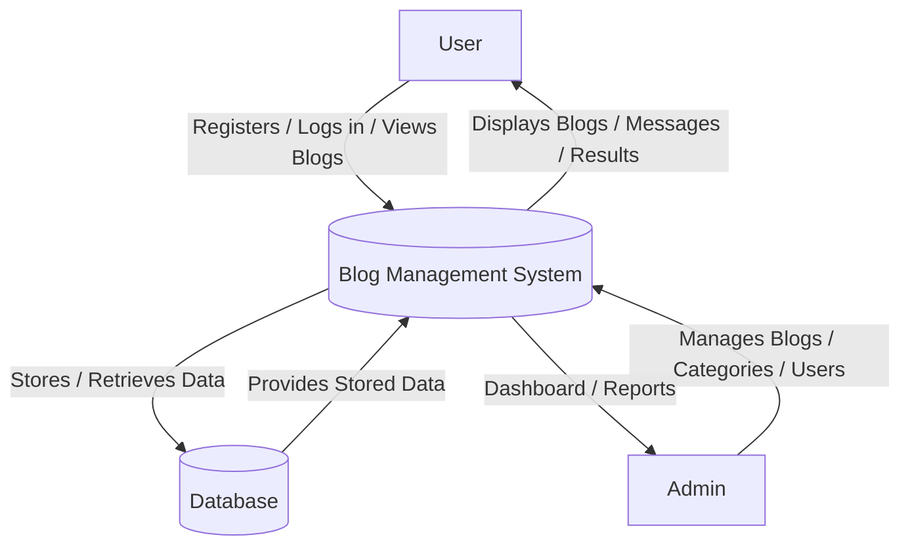
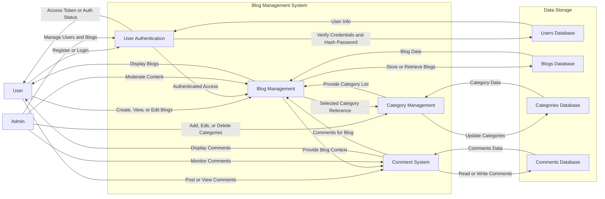
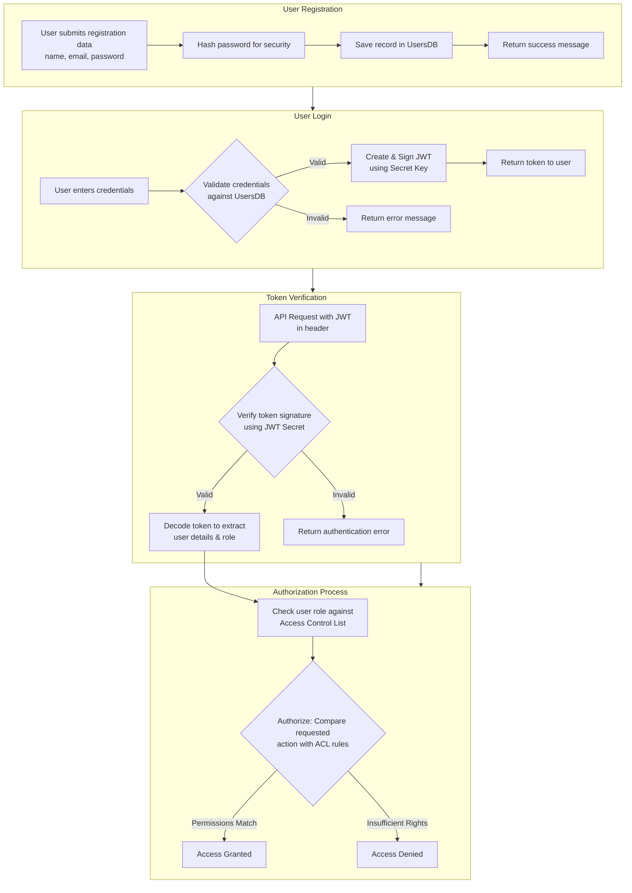

# Data Flow Diagram

This document presents the three levels of Data Flow Diagrams (DFD) for the **Blog Management Application**, showing how data moves between users, the frontend, backend, and supporting services.

---

## Level-0 DFD — Context Diagram

**Explanation:**
The Level-0 DFD (Context Diagram) shows the entire Blog Management System as a single process and how it exchanges data with external entities (User and Admin). It also shows the single logical Database used by the system.

## Level-1 DFD - System Decomposition

This document presents the three levels of Data Flow Diagrams (DFD) for the **Blog Management Application**, showing how data moves between users, the frontend, backend, and supporting services.

**Explanation:**
The Level-1 DFD decomposes the Blog Management System into major subsystems (User Authentication, Blog Management, Category Management, Comment System) and shows their interactions with the data stores (Users, Blogs, Categories, Comments) and with external actors (User and Admin).

## Authentication and Authorization 

**Explanation**

This document presents the authentication and authorization flow for the **JWT-based Application**, showing how user registration, login, token verification, and permission checks are handled between users, the frontend, backend, and supporting services.

