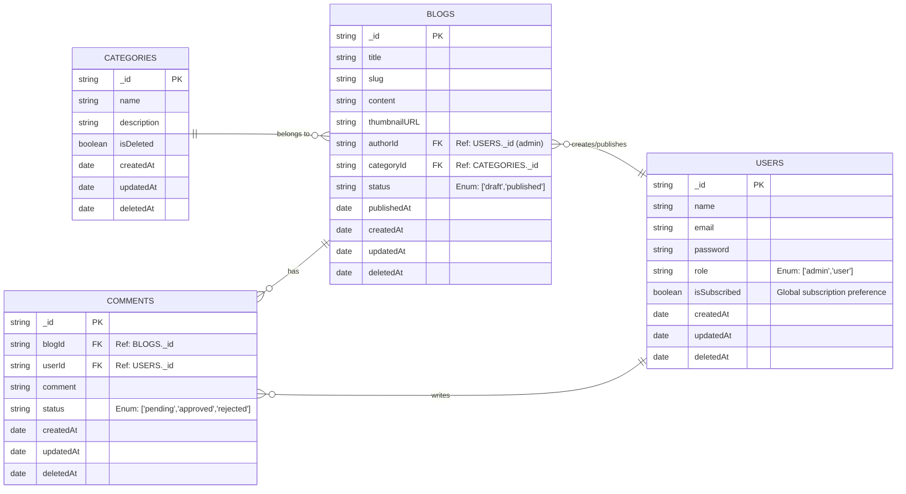

```mermaid
erDiagram
	direction RL

	USERS {
		string _id PK  
		string name  
		string email  
		string password  
		string role "Enum: ['admin','user']"  
		boolean isSubscribed "Global subscription preference"  
		date createdAt  
		date updatedAt  
		date deletedAt  
	}

	BLOGS {
		string _id PK  
		string title  
		string slug  
		string content  
		string thumbnailURL  
		string authorId FK "Ref: USERS._id (admin)"  
		string categoryId FK "Ref: CATEGORIES._id"  
		string status "Enum: ['draft','published']"  
		date publishedAt  
		date createdAt  
		date updatedAt  
		date deletedAt  
	}

	CATEGORIES {
		string _id PK  
		string name  
		string description  
		boolean isDeleted  
		date createdAt  
		date updatedAt  
		date deletedAt  
	}

	COMMENTS {
		string _id PK  
		string blogId FK "Ref: BLOGS._id"  
		string userId FK "Ref: USERS._id"  
		string comment  
		string status "Enum: ['pending','approved','rejected']"  
		date createdAt  
		date updatedAt  
		date deletedAt  
	}

	USERS ||--o{ BLOGS : "creates/publishes"
	BLOGS }o--|| CATEGORIES : "belongs to"
	BLOGS ||--o{ COMMENTS : "has"
	USERS ||--o{ COMMENTS : "writes"
```