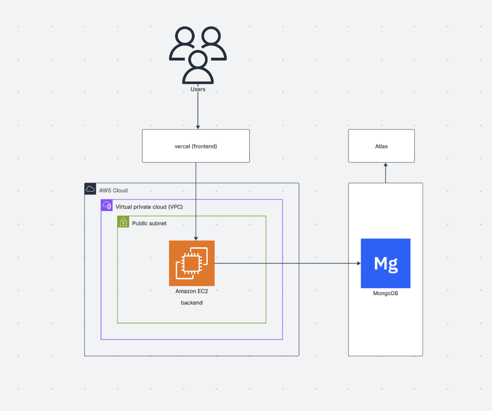

# AWS Deployment Architecture

**Explanation**

This diagram represents the **deployment architecture** of the *Blog Management Application* on AWS:

- **Users** access the application through a browser, connecting to the **frontend** hosted on **Vercel**  
- The **frontend** communicates with the **backend API**, which runs on an **Amazon EC2 instance** inside an **AWS Virtual Private Cloud (VPC)**  
- The **VPC** contains a **public subnet**, allowing secure and limited external access to the backend  
- The **backend** is responsible for handling business logic, authentication, and API endpoints  
- It connects to **MongoDB Atlas**, a managed cloud database service, for storing and retrieving data such as users, blogs, categories, and comments  
- **Atlas** handles database scalability and backups, while **AWS** manages compute resources  

This setup ensures:

- **Scalability** — components can scale independently (frontend via Vercel, backend via EC2)  
- **Security** — VPC and subnets isolate critical services  
- **Reliability** — managed services reduce downtime and maintenance overhead  
- **Separation of Concerns** — clear division between presentation, logic, and data layers